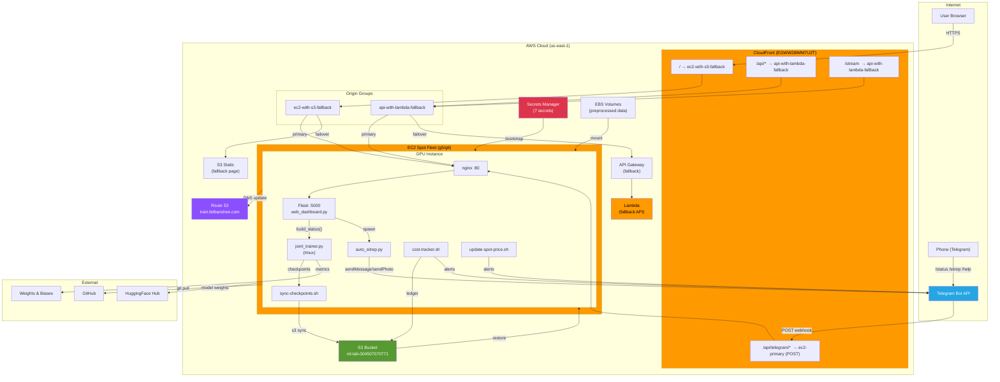
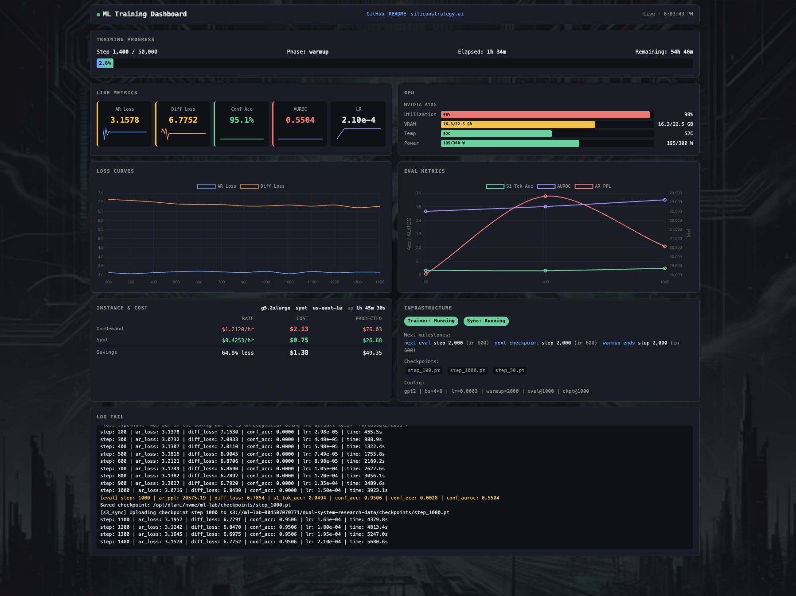
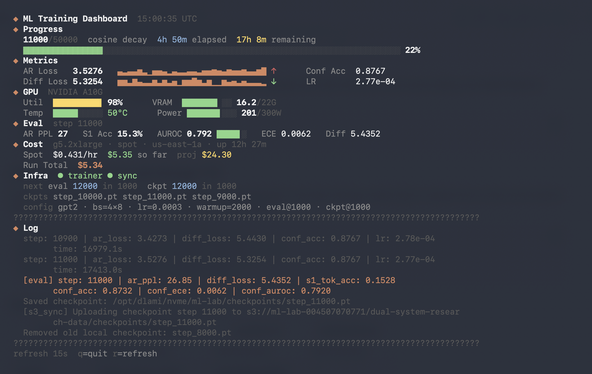

# Infrastructure & Operations

> This document covers the operational infrastructure for running the dual-process language model experiment on AWS spot instances. For research context, see [README.md](README.md).

## Table of Contents

- [AWS Architecture](#aws-architecture)
- [Spot Instance Resilience](#spot-instance-resilience)
- [Bootstrap](#bootstrap)
- [Checkpoint Management](#checkpoint-management)
- [Monitoring & Dashboards](#monitoring--dashboards)
- [Deployment](#deployment)
- [Cost Analysis](#cost-analysis)
- [Cost Controls](#cost-controls)
- [Notifications](#notifications)
- [Telegram Command Interface](#telegram-command-interface)

## AWS Architecture

| Component | Details |
|-----------|---------|
| **Compute** | EC2 Fleet (g5.2xlarge / g6.xlarge) — NVIDIA A10G or L4 GPUs, `maintain` type |
| **Storage** | Instance NVMe for fast I/O, S3 for persistence (`s3://ml-lab-004507070771/dual-system-research-data/`) |
| **Secrets** | AWS Secrets Manager — 7 secrets in `ml-lab/*` prefix (WANDB, HF, Telegram, Claude API, GitHub, dashboard spot token) |
| **Tracking** | [Weights & Biases](https://wandb.ai) for real-time experiment logging |
| **CDN/TLS** | CloudFront (`EGWW28IMM7U2T`) → ACM certificate → `train.bitbanshee.com` |
| **DNS** | `train.bitbanshee.com` → CloudFront ALIAS; `origin.train.bitbanshee.com` → EC2 A record (bootstrap-managed) |
| **Origin Policy** | `/api/*` and `/stream` behaviors use `AllViewerExceptHostHeader` origin request policy (API Gateway rejects forwarded Host header) |
| **Failover** | Origin groups: `ec2-with-s3-fallback` (default), `api-with-lambda-fallback` (/api/\*, /stream) — automatic failover on 500/502/503/504 |
| **Dashboard** | [train.bitbanshee.com](https://train.bitbanshee.com) — live web UI with training progress, GPU stats, loss curves, and cost tracking |
| **Notifications** | Telegram Bot — training alerts, spot reclaims, budget warnings, sitrep delivery |
| **IAM** | `ml-lab-ec2-bootstrap` role — S3, Secrets Manager, EC2 (fleet, EBS, describe), Route53 |

### Architecture Diagram



## Spot Instance Resilience

Training runs on spot instances with four layers of protection:

1. **S3 Sync Daemon** (`sync-checkpoints.sh`): Uploads checkpoints, logs, metrics, and preprocessed data to S3 every 60 seconds. The daemon runs under `set -uo pipefail` — if an individual `aws s3 sync` call fails (network issues, throttling), that cycle's output is logged but the daemon continues on the next 60-second interval. Training is not blocked by sync failures.
2. **SIGTERM Handler** (`SpotTerminationHandler` in `src/utils/s3_sync.py`): Catches the 2-minute termination warning and performs a final S3 sync before the instance dies.
3. **Checkpoint Resume** (`find_latest_checkpoint`): On startup, checks both local disk and S3 for the latest checkpoint, downloads if needed, and resumes training from that step.
4. **Telegram Notifications**: Spot reclaim events, budget alerts, and price ceiling hits are sent to Telegram for real-time awareness even when not watching the dashboard.

## Bootstrap

`bootstrap.sh` handles full autonomous instance setup with real-time status tracking (written to `/tmp/bootstrap_status.json` for the dashboard to display). Pulled from S3 on every boot (`s3://ml-lab-004507070771/dual-system-research-data/deploy/bootstrap.sh`). Tested across multiple spot recovery cycles with zero manual intervention.

| Step | Action | Notes |
|------|--------|-------|
| 0 | NVMe ephemeral storage | Create data directories on fast local disk |
| 1 | Fetch secrets | W&B, HF, Telegram, Claude API, GitHub, dashboard tokens from Secrets Manager |
| 2 | Configure environment | `.bashrc` env vars, git credentials |
| 3 | Pull latest code | `git pull --ff-only` |
| 4 | Restore artifacts from S3 | Checkpoints, logs, eval metrics, benchmarks (~3 min) |
| 5 | Attach EBS static data volume | Tagged `ml-lab-static-data`, contains preprocessed data. Falls back to S3 if unavailable |
| 6 | Sync preprocessed data | Tokenized training data from EBS or S3 |
| 7 | Fix file ownership | S3 restores as root |
| 8 | Update CloudFront DNS | `origin.train.bitbanshee.com` A record → instance IP |
| 9 | Start sync daemon | `sync-checkpoints.sh` (60s interval) |
| 10 | Install nginx | apt install (if missing) |
| 11 | Configure nginx | HTTP-only reverse proxy (CloudFront handles TLS) |
| 12 | Install Flask | pip install (if missing) |
| 13 | Start web dashboard | Flask on :5000, with Telegram env vars and `--telegram-webhook-secret` |
| 14 | Setup spot price updater | Initial run + cron every 5 min (with SPOT_TOKEN env var) |
| 15 | Setup cost tracker | `cost-tracker.sh init` — download ledger from S3, cron every 5 min with Telegram env vars |
| 16 | Setup auto-sitrep | Cron every 30 min with Telegram env vars |
| 17 | Launch training | tmux session, auto-resumes from latest checkpoint (v3 paths) |

## Checkpoint Management

- **Save frequency**: Every 1,000 training steps
- **Local retention**: Last 3 checkpoints (automatic cleanup)
- **S3 retention**: All checkpoints preserved
- **Format**: PyTorch `.pt` files containing model state, optimizer state, scheduler state, step counter, and RNG states
- **File size**: ~1.4 GB per checkpoint (GPT-2 Small; dominated by optimizer state)
- **Resume logic**: On startup, compares local and S3 checkpoints, downloads the latest if S3 is ahead

## Monitoring & Dashboards

Three monitoring interfaces share the same on-disk data sources but serve different use cases.

### Data Flow

```
joint_trainer.py
  ├─ wandb output.log ──────── step lines (ar_loss, diff_loss, conf_acc, lr, time)
  │                             [eval] lines (ar_ppl, diff_loss, s1_tok_acc, conf_acc, conf_ece, conf_auroc)
  ├─ eval_metrics/*.json ────── one JSON per eval checkpoint
  ├─ checkpoints/*.pt ───────── model + optimizer state
  └─ configs/tiny.yaml ──────── training hyperparameters

/tmp/spot_price.json ────────── spot pricing (written by cron via update-spot-price.sh)
/tmp/bootstrap_status.json ──── bootstrap progress (written by bootstrap.sh)
EC2 IMDS v2 ─────────────────── instance type, lifecycle, AZ, boot time
nvidia-smi ──────────────────── GPU util, VRAM, temp, power
```

### web_dashboard.py — Live Web Dashboard



Single-file Flask application (1,800 lines) serving an inline HTML/CSS/JS dashboard at [train.bitbanshee.com](https://train.bitbanshee.com). Designed for remote monitoring over CloudFront.

| Layer | Technology |
|-------|-----------|
| Backend | Flask, Server-Sent Events (SSE) at `/stream` (10s interval) |
| Frontend | Vanilla JS, Chart.js (loss curves + eval metrics), inline CSS |
| Caching | Per-key TTL cache (2–60s) to avoid re-parsing on every SSE push |
| Proxy | nginx (HTTP, port 80) → CloudFront (TLS termination) → `train.bitbanshee.com` |

**Key features:**
- **Live metrics cards** (6 tiles: AR Loss, Diff Loss, Conf Acc, AUROC, S1 Acc, LR) with RAG color coding and sparklines
- **Loss curves chart** — AR loss + diffusion loss over training steps, auto-refreshes on new data
- **Eval metrics chart** — S1 token accuracy, AUROC, AR perplexity; filtered to current run only
- **GPU gauges** — utilization, VRAM, temperature, power with color thresholds
- **Instance & GPU card** — merged instance info, cost tracking, and GPU metrics in one card
- **Spot cost tracking** — live spot pricing, accumulated cost, projected run total
- **Bootstrap progress panel** — step-by-step instance boot status (auto-hides when complete)
- **Infrastructure status** — trainer/sync daemon health, checkpoint list, next milestones
- **Telegram integration** — spot reclaim notifications

**API endpoints:**

| Endpoint | Description |
|----------|------------|
| `GET /api/status` | Full status payload (training, eval, GPU, cost, infra, bootstrap) |
| `GET /api/history` | Training step data for loss chart |
| `GET /api/eval/history` | Merged eval JSONs + log-parsed eval lines |
| `GET /stream` | SSE stream — pushes `/api/status` every 10s |
| `POST /api/spot-price` | Accepts spot price data from external updater (token-auth) |
| `POST /api/telegram/webhook` | Telegram bot command handler (secret-token auth) |

### monitor.sh — Terminal Dashboard



Bash script (430 lines) rendering a full-screen ANSI terminal dashboard. Designed for SSH sessions on the GPU instance.

```bash
./monitor.sh        # 15s refresh (default)
./monitor.sh 5      # 5s refresh
```

### dashboard.py — Curses Job Manager TUI

Python curses application (880 lines) for interactive job management. Launches training, smoke tests, or pytest from a menu and monitors the running process with live output, GPU stats, and parsed metrics.

```bash
python dashboard.py              # Interactive menu
python dashboard.py --job tiny   # Launch training directly
python dashboard.py --job smoke  # Launch smoke test
python dashboard.py --job test   # Launch pytest
```

### Comparison

| Feature | web_dashboard.py | monitor.sh | dashboard.py |
|---------|-----------------|------------|-------------|
| Access | Browser (remote) | SSH terminal | SSH terminal |
| Charts | Chart.js (loss + eval) | Sparklines (ANSI) | — |
| RAG indicators | Color-coded metric cards | Color-coded gauges | — |
| Cost tracking | Full (on-demand + spot) | Full | — |
| Bootstrap status | Progress panel | — | — |
| Job control | View only | View only | Launch + monitor |
| Dependencies | Flask, nginx, CloudFront | bash, bc, python3 | Python curses |

## Deployment

### AMI Snapshots

The training environment is baked into an AMI to avoid lengthy setup on each spot instance launch:
- AMI: `ami-0544093f9b5424470` (`dual-system-v2-complete-20260307`, clean — no baked secrets, all secrets fetched at boot from Secrets Manager)
- Launch template: `lt-06e111b12bd85396f`, v20
- Pre-installed: Python 3.12, PyTorch 2.6, CUDA 12.4, full ML stack
- Fleet ID: `fleet-2840fcd1-6c2d-44c0-ad17-7f3799ca6c9a`

### Secrets Management

All secrets are stored in AWS Secrets Manager and fetched at boot (bootstrap Step 1). The AMI contains no credentials — it's safe to share or snapshot.

| Secret ID | Purpose | Used by |
|-----------|---------|---------|
| `ml-lab/wandb-api-key` | Weights & Biases experiment tracking | joint_trainer.py |
| `ml-lab/hf-token` | HuggingFace model downloads | bootstrap.sh |
| `ml-lab/dashboard-spot-token` | Dashboard write API authentication | update-spot-price.sh, web_dashboard.py |
| `ml-lab/claude-api-key` | Claude API for sitrep generation | auto_sitrep.py |
| `ml-lab/telegram-bot-token` | Telegram notification bot | auto_sitrep.py, cost-tracker.sh, update-spot-price.sh, web_dashboard.py |
| `ml-lab/telegram-chat-id` | Telegram chat destination | Same as above |
| `ml-lab/gh-token` | GitHub push access | bootstrap.sh (.git-credentials) |
| *(derived)* `TELEGRAM_WEBHOOK_SECRET` | Telegram webhook validation | Generated from bot token hash at boot (not stored in Secrets Manager) |

Secrets are written to `~/.bashrc` as exports during bootstrap Step 2, and `.git-credentials` is created for GitHub push access.

### Quick Start (Instance Management)

```bash
# Start the fleet (launches a spot instance)
aws ec2 modify-fleet --fleet-id fleet-2840fcd1-6c2d-44c0-ad17-7f3799ca6c9a --target-capacity-specification TotalTargetCapacity=1,SpotTargetCapacity=1,DefaultTargetCapacityType=spot

# Stop the fleet
aws ec2 modify-fleet --fleet-id fleet-2840fcd1-6c2d-44c0-ad17-7f3799ca6c9a --target-capacity-specification TotalTargetCapacity=0,SpotTargetCapacity=0,DefaultTargetCapacityType=spot

# SSH to instance
ssh -i gpu-key.pem ubuntu@origin.train.bitbanshee.com
```

## Cost Analysis

### Spot Pricing

Spot pricing varies by instance type and availability zone. The `update-spot-price.sh` script monitors current prices via cron (every 5 minutes) and feeds data to the dashboard.

| Instance | GPU | On-Demand | Spot (typical) | Savings |
|----------|-----|-----------|----------------|---------|
| g5.2xlarge | A10G (24GB) | $1.212/hr | ~$0.43/hr | ~65% |
| g6.xlarge | L4 (24GB) | $0.805/hr | ~$0.30/hr | ~63% |

### Projected Training Cost

**Pure compute estimate** (uninterrupted):
- 50,000 steps at ~0.50 steps/sec = ~28 hours of GPU time (including eval every 1,000 steps)
- g5.2xlarge spot: ~$12 per complete run (~$24 with spot overhead across multiple allocations)

**Actual v1 cost**: $27.62 across 4 spot instances, 3 reclamation recoveries. Spot overhead approximately doubled pure compute cost (consistent with projection). Training completed at step 50,000 on 2026-03-03.

**Actual v2 cost**: $31.44 across 15 spot instances, 31 reclamation recoveries. Higher instance count due to increased spot market volatility during the training period (March 4–7). Training completed at step 50,000 on 2026-03-07.

S3 storage: negligible (~$0.02/month for checkpoints and logs)

## Cost Controls

Three automated circuit breakers protect against runaway spend. All thresholds are configurable via environment variables in `bootstrap.sh`.

### Budget Cap

| Parameter | Default | Script | Frequency |
|-----------|---------|--------|-----------|
| `MAX_BUDGET` | $50 | `cost-tracker.sh` | Every 5 min (cron) |

The cost tracker maintains a persistent ledger across spot instance sessions (`cost/cost_ledger.json` in S3). On each `update` cycle, it compares accumulated `total_cost` against `MAX_BUDGET`. If the budget is exceeded, the fleet is automatically shut down via `aws ec2 modify-fleet --target-capacity-specification TotalTargetCapacity=0`. Training resumes from the latest checkpoint when the fleet is manually restarted.

A Telegram notification is sent before fleet shutdown, including the total cost and budget limit.

### Spot Price Ceiling

| Parameter | Default | Script | Frequency |
|-----------|---------|--------|-----------|
| `MAX_SPOT_PRICE` | $0.75/hr | `update-spot-price.sh` | Every 5 min (cron) |

The spot price updater queries `aws ec2 describe-spot-price-history` for the current instance type and AZ. If the current market price meets or exceeds `MAX_SPOT_PRICE`, the fleet is shut down before the next billing interval at the elevated rate. At the default ceiling of $0.75/hr (67% above typical g5.2xlarge spot of ~$0.45/hr, 38% below on-demand at $1.21/hr), the worst-case full-run cost is ~$41 — still below the $50 budget cap.

A Telegram notification is sent before fleet shutdown, including the current rate and ceiling.

### Fleet-Level Controls

| Setting | Value | Effect |
|---------|-------|--------|
| Fleet type | `maintain` | Auto-replaces terminated instances |
| Allocation strategy | `capacity-optimized` | Picks AZ with most spare capacity |
| Capacity rebalance | `launch-before-terminate` (120s delay) | Overlaps old/new instances during rebalance |
| Max price | Not set (defaults to on-demand ceiling) | Application-level ceiling preferred |
| Instance pool | 3 types × 3 AZs = 9 pools | `g5.xlarge`, `g5.2xlarge`, `g6.xlarge` across `us-east-1a/b/f` |

**Note:** The fleet does not set `MaxPrice` at the EC2 level. Cost control is handled at the application layer via the spot price ceiling, which is more flexible (can be changed without recreating the fleet) and provides a single control point with dashboard visibility.

### Dashboard Visibility

The web dashboard displays real-time cost control status:
- **Budget usage**: Current total cost vs budget cap, color-coded (green/yellow/red at 70%/90% thresholds)
- **Spot rate vs ceiling**: Current spot price vs max allowed, color-coded (green/yellow/red at 50%/80% thresholds)
- Both are shown in the instance card alongside existing cost metrics

## Notifications

Telegram bot integration provides real-time alerts for critical events. The bot token and chat ID are stored in Secrets Manager and propagated to all processes that send notifications.

### Notification Types

| Event | Source | Trigger |
|-------|--------|---------|
| Bootstrap complete | `bootstrap.sh` | Step 18 finishes successfully |
| Spot reclaim detected | `web_dashboard.py` | Instance lifecycle changes to `spot-terminated` (via IMDS) |
| Budget exceeded | `cost-tracker.sh` | `total_cost >= MAX_BUDGET` ($50 default) |
| Spot price ceiling hit | `update-spot-price.sh` | `current_price >= MAX_SPOT_PRICE` ($0.75/hr default) |
| Sitrep delivery | `auto_sitrep.py` | Every 30 min (includes formatted SITREP) |
| Training milestone | `auto_sitrep.py` | Key step thresholds reached |
| On-demand sitrep | `web_dashboard.py` → `auto_sitrep.py` | User sends `/sitrep` via Telegram |
| On-demand status | `web_dashboard.py` | User sends `/status` via Telegram |

### Implementation

Outbound notifications use `send_telegram()` in `auto_sitrep.py` as the canonical implementation. Other scripts import or inline-call this function. Inbound commands are handled by the webhook route in `web_dashboard.py`, which validates the secret token header and dispatches to per-command handlers. Both use the Telegram Bot API with `sendMessage` / `sendPhoto` endpoints.

**Env var propagation:** Cron jobs don't inherit `.bashrc` (interactive shell guard). Bootstrap sets `TELEGRAM_BOT_TOKEN` and `TELEGRAM_CHAT_ID` inline in each cron command. The dashboard process also receives these env vars explicitly at launch.

## Telegram Command Interface

On-demand commands via Telegram complement the scheduled notifications. The user sends a command from their phone; Telegram delivers it as a webhook POST to the Flask dashboard.

### Request Flow

```
Phone → Telegram API → CloudFront (/api/telegram/*) → nginx → Flask → handler
                                                                    ↓
                                                            Telegram API ← response
```

**CloudFront note:** The `/api/telegram/*` behavior routes directly to `ec2-primary` (not an origin group) because CloudFront prohibits POST methods on behaviors using origin groups. The `AllViewerExceptHostHeader` origin request policy forwards the `X-Telegram-Bot-Api-Secret-Token` header for validation.

### Commands

| Command | Response | Cooldown | Implementation |
|---------|----------|----------|----------------|
| `/status` | Inline text: step, GPU, metrics, cost, ETA | 15s | `build_status()` in web_dashboard.py |
| `/sitrep` | Acknowledges, then delivers full sitrep + metrics image | 60s | Spawns `auto_sitrep.py --force-telegram` |
| `/help` | Lists available commands | none | Static text reply |

### Security

| Layer | Mechanism |
|-------|-----------|
| **Secret token** | Telegram includes `X-Telegram-Bot-Api-Secret-Token` header; Flask validates against `TELEGRAM_WEBHOOK_SECRET` |
| **Chat ID filter** | Only responds to the configured `TELEGRAM_CHAT_ID`; other chats silently ignored (200 OK) |
| **Rate limiting** | Per-command cooldowns prevent abuse (in-memory, resets on dashboard restart) |
| **CloudFront** | TLS termination, DDoS protection, header forwarding via origin request policy |

### Webhook Registration

Registered automatically during bootstrap Step 16 via Telegram's `setWebhook` API:
```bash
curl -sf "https://api.telegram.org/bot${TELEGRAM_BOT_TOKEN}/setWebhook" \
    -d "url=https://train.bitbanshee.com/api/telegram/webhook" \
    -d "secret_token=${TELEGRAM_WEBHOOK_SECRET}" \
    -d "drop_pending_updates=true" \
    -d 'allowed_updates=["message"]'
```

The webhook secret is generated deterministically from the bot token (`sha256sum`) during bootstrap Step 1, ensuring consistency across spot instance recoveries without storing an additional secret.

### Files

| File | Role |
|------|------|
| `web_dashboard.py` | Webhook route, command handlers, rate limiter, `_send_telegram_reply()` |
| `auto_sitrep.py` | `--force-telegram` flag for on-demand sitrep generation with file lock |
| `bootstrap.sh` | Webhook secret generation (Step 1), dashboard env var plumbing (Step 12), webhook registration (Step 16) |
